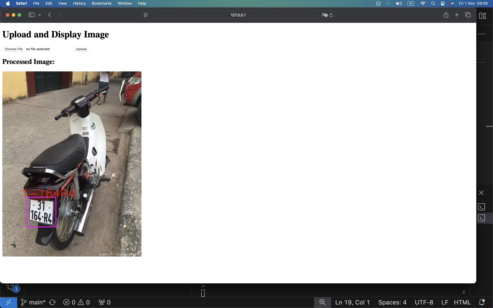

# Phát hiện và nhận dạng biển số (Number plate detection and recognition)
# Deploy web
Các file deployment

/static

/templates

/my_api

/requirement txt

# Tiến độ 60% (khi chưa deploy, cải tiến)
## Install environments
**Công cụ (Tool):**<br>
* Jupyter Notebook or Google Colab (train)
* Visual Studio Code: run main.py và my_api.py (có thể gặp lỗi do thiếu thư viện)
* Deployment for developer to test: Postman
* Containerization to run: Docker (ko lo bị lỗi thiếu thư viện nhưng chờ lâu khúc build image 7.69GB)

**Ngôn ngữ (Language):**<br>
* Python 3.12.5

## real-time
https://github.com/Hung-3008/LPDR

## RUN
Cách 1:
Các bạn có thể clone repo này về. Open VSCode, run my_api.py :
```
cd CV-Number-plate-detection-and-recognition
/usr/local/bin/python3.12 /Users/c/Downloads/CV-Number-plate-detection-and-recognition/source/yolov3/License-Plate-Recognition-master-4/my_api.py
```
Cách 2:
Trước khi dùng cmd bất kì cmd docker nào, run:
```
export PATH="$PATH:/Applications/Docker.app/Contents/Resources/bin/"
```
Login Docker with jasoncaption as username
```
docker login -u jasoncaption
```

build image named jason/number_plate
```
docker build -f /Users/c/Downloads/CV-Number-plate-detection-and-recognition/source/Dockerfile -t jason/number_plate .
```
run image in a container named abcxyz
```
docker run --name abcxyz jason/number_plate
```
## Result
<p align="center" >
   <br>
</p>
